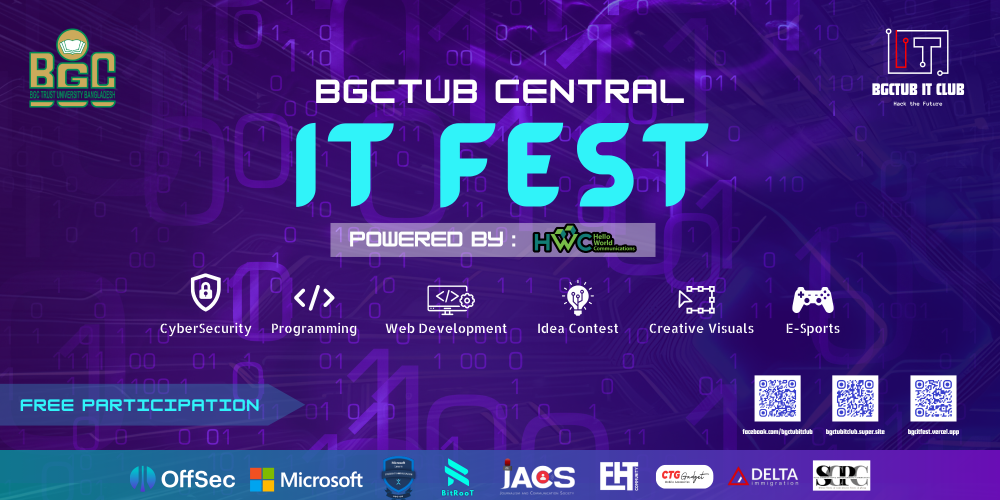

# BGCTUB Central IT Fest CTF

Official repository for challenges from **BGCTUB Central IT Fest CTF** organized by **BGC Trust University Bangladesh IT-Club**.

## 🎯 Overview

This CTF featured **12 unique challenges** across 5 categories, testing participants' skills in various cybersecurity domains.

## 📂 Categories

### 🔐 Cryptography (3 Challenges)
- **Rising Base** - Easy
- **Hidden Pixels** - Easy
- **Hashed** - Easy

### 🔍 OSINT (3 Challenges)
- **Detective #1** - Easy
- **Detective #2** - Medium
- **Pin Point** - Easy

### ⚙️ Reverse Engineering (2 Challenges)
- **Databank** - Easy
- **X - OR - Nothing** - Medium

### 🌐 Web Exploitation (3 Challenges)
- **Robots** - Easy
- **Too Trusting** - Easy
- **Employee Portal** - Medium

### 🔬 Digital Forensics (1 Challenge)
- **BGCTUB-ITC Breach** - Easy / Medium / Hard

## 🎥 Video Walkthroughs

All challenge walkthroughs are available on our YouTube channel. See [wakthrroughs](docs/walkthroughs.md) for the complete playlist.

## 🚀 Getting Started

### For Participants
1. Clone the repository
2. Navigate to the challenge category
3. Read the challenge README.md
4. Download challenge files from `challenge_files/` directory for each challenges
5. Submit flags in format: `BGCTUB_ITC{...}`

### For Challenge Deployers
See [SETUP](docs/SETUP.md) for deployment instructions.

## 📊 Challenge Difficulty Distribution

| Category | Easy | Medium | Hard |
|----------|------|--------|------|
| Cryptography | 3 | 0 | 0 |
| OSINT | 2 | 1 | 0 |
| Reverse Engineering | 1 | 1 | 0 |
| Web Exploitation | 2 | 1 | 0 |
| Digital Forensics | 8 | 3 | 4 |

## 🏆 Flag Format

All flags follow the format: `BGCTUB_ITC{...}`

## 📝 License

- See [License](docs/LICENSE)

## 👥 Contributors

- **[EHT Community](https://www.facebook.com/ehtcommunity)**
- Challenge Authors: [h4x0r3rr0r](https://www.facebook.com/h4x0r3rr0r)

## 📞 Contact

- 🌐 Website: https://bgctub-it-club.vercel.app/
- 📧 Email: itc@bgctub.ac.bd
- 📱 Social Media: https://www.facebook.com/bgctubitclub/

## ⭐ Acknowledgments

Thanks to all participants and the organizing team for making this CTF successful!

---

**Note**: Solutions are provided for educational purposes. Please use this knowledge ethically.
